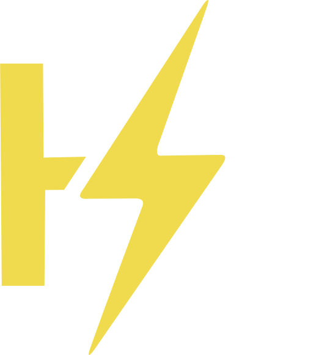
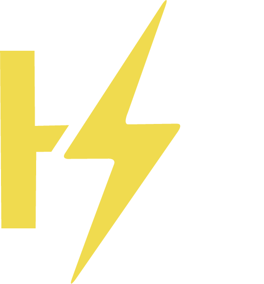
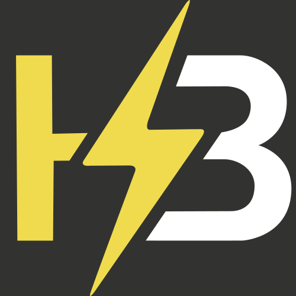

# 🎨 H3 Logo

| Variant         | SVG                                      | PNG                                     |
|-----------------|------------------------------------------|-----------------------------------------|
| h3 (light)      |  |  |
| h3 (dark)       |   |   |
| h3 (bg)         |     |     |

## Colors

(inspired from [JavaScript](https://www.schemecolor.com/javascript-logo-colors.php) Logo)

- **primary:** Minion Yellow (`#F0DB4F`)
- **secondary:** Dark Charcoal (`#323330`)

## License

H3 icon designed by Thimo ([@ThimoDEV](https://github.com/ThimoDEV)) and Josje ([@Uniiscript](https://github.com/Uniiscript))

H3 designs is licensed under <a href="https://creativecommons.org/licenses/by-nc-nd/4.0/?ref=chooser-v1" target="_blank" rel="license noopener noreferrer" style="display:inline-block;">CC BY-NC-ND 4.0</a>

